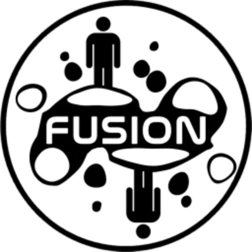

<h1 align="center"> FLB | Website</h1>

<a href="https://github.com/FusionLobbyBrowser/Website/actions/workflows/preview.yml">

</a>

This is a website that allows for browsing lobbies provided by [LabFusion](https://github.com/Lakatrazz/BONELAB-Fusion/), a multiplayer mod for the game [BONELAB](https://store.steampowered.com/app/1592190/BONELAB/). The purpose of the website is to allow players to check what lobbies are up before even launching BONELAB, basically allowing to make sure if it's even worth launching BONELAB in case you want to play LabFusion.

The website features a join button, which thanks to a [MelonLoader Mod](https://github.com/FusionLobbyBrowser/Mod), allows to launch the game & immiediately join the lobby or do that while the game is already running!

Thanks to [@Checkerb0ard](https://github.com/Checkerb0ard) for helping with adding support for Epic Games Network Layer!

## Discord Servers

In the more info view, FLB allows for displaying simple information about a linked discord server, as well as a join button to allow people to quickly enter the Discord Server.
For it to be displayed, you need to actually "link" a discord server. This can be done by providing a discord invite link in the description. Currently several formats are supported:

* `https://discord.gg/code`
* `discord.gg/code`
* `.gg/code`
* `https://discord.com/invite/code`
* `discord.com/invite/code`
* `Discord: code`
* `Discord Server: code`
* `Discord Link: code`
* `Discord Code: code`

> [!NOTE]
> In links, you can use commas (`,`) instead of dots. LabFusion added a link filter and does not display links, this can be used to bypass it. Though even if LabFusion filters the links, it is still visible and processed on the website.

## Licenses

Website is licensed under the MIT License. See [LICENSE](https://github.com/FusionLobbyBrowser/Website/blob/main/LICENSE) for the full License.

**Third-party Libraries used as Source Code:**

* [DOMPurify](https://github.com/cure53/DOMPurify) is licensed under the Apache License, Version 2.0. See [LICENSE](https://github.com/cure53/DOMPurify/blob/main/LICENSE) for the full License.

* [unity-rich-text-converter](https://github.com/AWaterColorPen/unity-rich-text-converter) is licensed under the MIT License. See [LICENSE](https://github.com/AWaterColorPen/unity-rich-text-converter/blob/master/LICENSE) for the full License.

* [oneko.js](https://github.com/adryd325/oneko.js/) is licensed under the MIT License. See [LICENSE](https://github.com/adryd325/oneko.js/blob/main/LICENSE) for the full License.

* [Font-Awesome](https://github.com/fortawesome/font-awesome) is licensed under the SIL OFL 1.1 and MIT License. See [LICENSE](https://github.com/fortawesome/font-awesome/blob/7.x/LICENSE.txt) for the full License.

**Third-party Libraries/Resources imported when opened:**

* [tippyjs](https://github.com/atomiks/tippyjs) is licensed under the MIT License. See [LICENSE](https://github.com/atomiks/tippyjs/blob/master/LICENSE) for the full License.

* [sweetalert2](https://github.com/sweetalert2/sweetalert2) is licensed under the MIT License. See [LICENSE](https://github.com/sweetalert2/sweetalert2/blob/main/LICENSE) for the full License.

* [flag-icons](https://github.com/lipis/flag-icons) is licensed under the MIT License. See [LICENSE](https://github.com/lipis/flag-icons/blob/main/LICENSE) for the full License.

* [Fuse.js](https://github.com/krisk/fuse) is licensed under the Apache License 2.0. See [LICENSE](https://github.com/krisk/Fuse/blob/main/LICENSE) for the full License.

* [Fusion-Lists](https://github.com/Lakatrazz/Fusion-Lists) (`profanityList.json`) is licensed under the MIT License. See [LICENSE](https://github.com/Lakatrazz/Fusion-Lists/blob/main/LICENSE) for the full License.

* [LabFusion](https://github.com/Lakatrazz/BONELAB-Fusion) (Icons) is licensed under the MIT License. See [LICENSE](https://github.com/Lakatrazz/BONELAB-Fusion/blob/main/LICENSE) for the full License.
